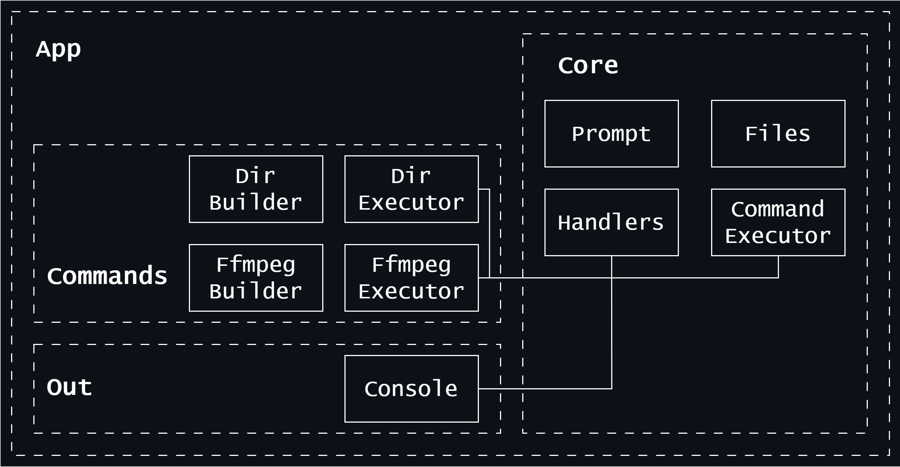

# Command executor

Command executor is a small but powerful utility that can help you to execute your commands easier. You will not be needed to memorize all the arguments. All you need is to make your life easier:

1. Add all necessary options to ```<utility>.builder.ts``` file and you will be able to define appropriate options easily
2. Override functions of ```abstract class CommandExecutor``` in ```<utility>.executor.ts```
3. Add some needed types to ```<utility>.types.ts```

These three steps will definitely improve your command line user experiance!

---

Here is a small image, that demonstrates the app architecture.



You can add modules to ```Out``` folder to specify other outputs.

You can add modules to ```Commands``` folder to specify new commands.

## Running the application

To run the application you need Node.js and NPM to be installed.

1. Install TypeScript

    ```bash
    npm install -g typescript
    ```

2. Download dependencies

    ```bash
    npm install
    ```

3. Compile TypeScript files

    ```bash
    tsc
    ```

4. Run created ```app.js``` file

    ```bash
    node ./dist/app.js
    ```

That's all! Now your command is running!

## Using example command

As an example we will run ffmpeg command. Ffmpeg is a powerfull utility that provides different opportunuties to work with videos, for example, decode, encode, transcode, ect.
If you don't have ffmpeg, you can download it from [ffmpeg website](https://www.ffmpeg.org/download.html).

Running the example:

1. Follow the steps from "Running the application" block

2. Enter requested params. After entering each value type ```Enter``` key. Requested params are

    * **Path to file** – absolute incoming video path
    * **Width** – outcoming video width
    * **Height** – outcoming video hieght
    * **Name** – outcoming video name

3. After entering the last value and typing ```Enter``` key you will see ffmpeg log. When the process will be finished, you will see ```Done!``` messsage and see converted video as well.

Add any commands you need and use them withought headache!
